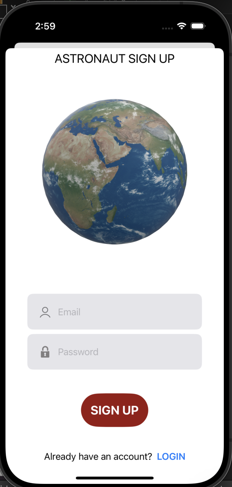
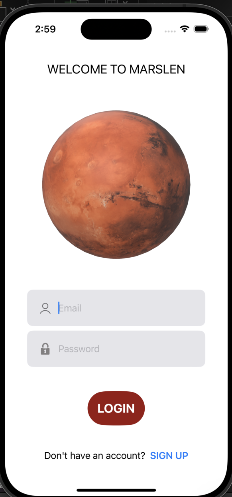
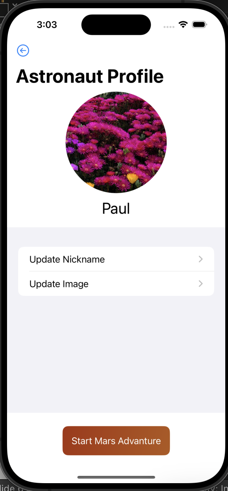
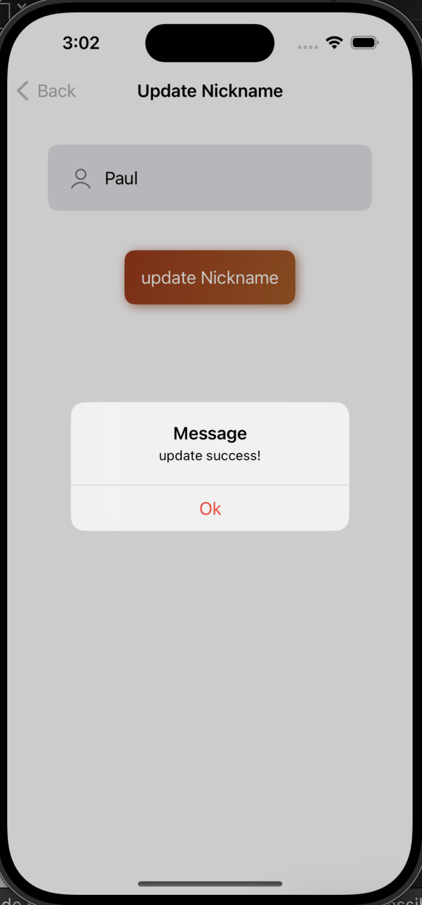
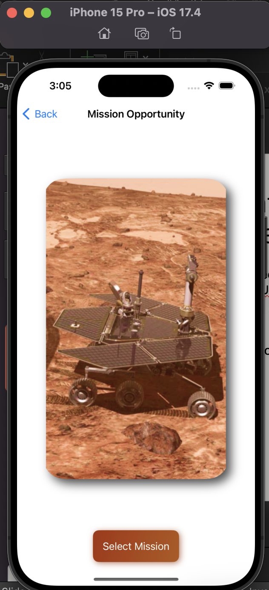
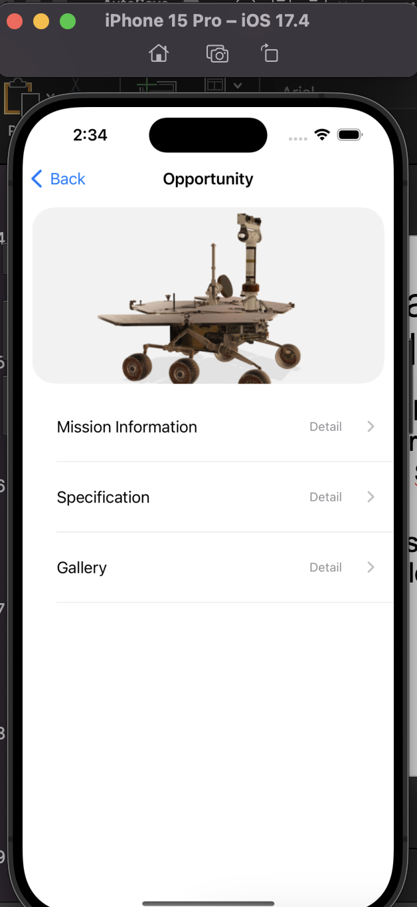
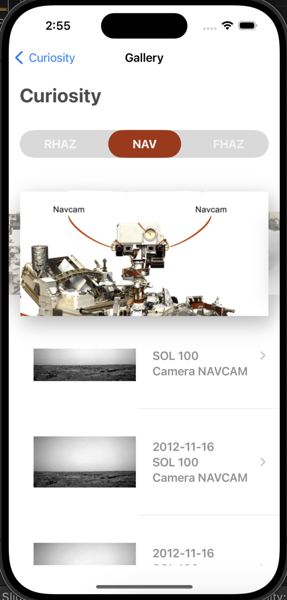
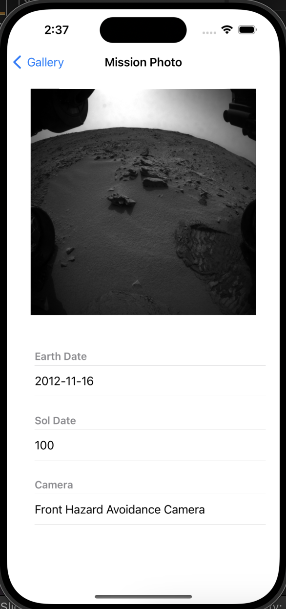
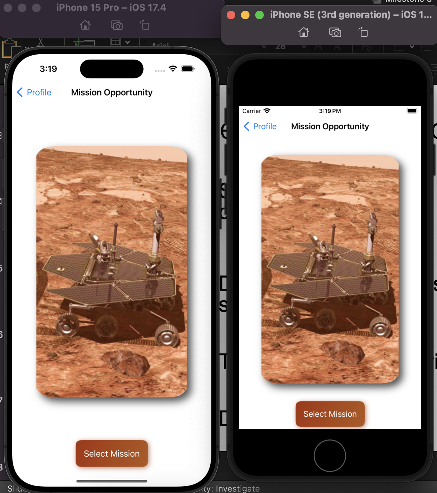

# Project - Mars Len

- This is a repo of the project Mars Lens, the fianl project of the iOS course.

---

## Features

- [x] User Authentication

  - Enable user to Sign up and login.
  - Google Firebase Auth

- [x] User Profile

  - Load email from Firebase Database
  - Firebase Database

- [x] User Image

  - Enable user to upadte their images
  - Google Firebase Database

- [x] Select Mars Rovers

  - Enable user to select Mars Rovers
  - Image Carousel

- [x] Load Image List

  - Based on selected date, load images

- [x] Load Image
  - Based on user selection, Load Images

---

---

[TOP](#project---mars-len)
